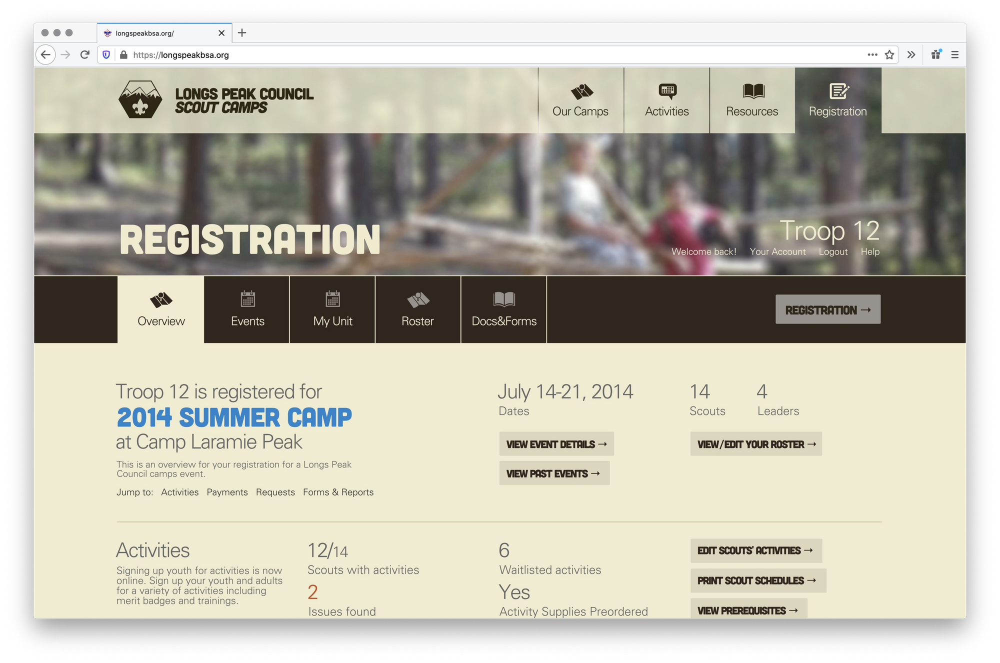

==========================

Camper is a summer camp registration and management platform for Scouting Councils.

Overview
--------------------------

Camper was first launched in 2005 by Sean Wittmeyer for Longs Peak Council and the summer camp operations at Ben Delatour Scout Ranch. It was in active development until its replacement came along in 2014. It is a full featured summer camp management platform that supported both simple events such as a single weekend campout and complex multi-session events such as a 10 week summer camp. Class and activity and merit badge registration with waitlisting, group/troop management with participant trackers, payments, scheduling tools, event reporting tools, and a communication platform made up the bulk of the website. It also featured unique portals for participants/leaders, council staff, and a lightweight and mobile-ready At-Camp module for attendance. 
Camper processed over $4 million in payments in its time at Longs Peak Council and facilitated over 8,000 event registrations, 46,000 class registrations across 177 events.
The current version is 1.5 Beta 1

Installation
--------------------------

Installing Camper is not as easy as it should be but you can do so with some easy steps:

* Requires a LAMP stack with PHP 5.3 (CodeIgniter 2 will not run on PHP 5.6+ or 7+) and any SQL database supported by CodeIgniter 2 framework (only tested with mysqli)
* Grab the entire repo from seanwittmeyer/camper and place the code at the top level directory publicly visible for your domain.
* Run Composer with the included composer.json file to populate php dependencies
* Rename the camper_example.php and database_example.php files and update their content with relevant keys and passwords
* Initialize the database from the included mysql dump file (not included/prepared yet, talk to Sean for this)
* Sign in with the default user (admin:Password!)

Camper was set up to use PayPal for collecting and processing financial transactions and can be configured in the camper.php file highlighted above. The site also uses some older libraries for generating PDF's, accessing API's using a SSL library and associated certificates which may need to be updated.

Configuration
--------------------------

The time hasn't been put into updating Camper for PHP 7.2+ or Code Igniter 3/4 nor have any of the configuration variables been migrated into a .env file, if there is interest, this could be a task to bring it all back up to modern times. It would be nice to containerize the app for modern deployment.

Usage
--------------------------

The way we have been using the platform started with adding any and all content we create and through complete and strategic tagging, we have made ways to access content through tags. More on this soon.

Security
--------------------------

If you discover a security vulnerability within this package, please send an email to Sean Wittmeyer at theseanwitt [at] gmail [dot] com. All security vulnerabilities will be promptly addressed.

License
--------------------------

Pylos is copyright Sean Wittmeyer is licensed under [The MIT License](LICENSE).

Change Log
--------------------------

1.5b1 (current)
* Added new tools for the admin users for individual and unit user types. Admins can now transfer accounts between the two types, and can edit den and individual details.
* Added new ways for admin to see class registrations and numbers in the class editor.
* Cleaned up some older and messy records, added cleanup methods to help the system run a little quicker and smoother.

1.4.3
* Resolved 2 security issues and 18 class and registration bugs.

1.4.1 and 1.4.2
* Fixed a number of issues with the class registration system, including how the system counts open spots and reports waitlists.

1.4.0
* The activity library has been added. Activities are system wide entities that can be offered as classes for member registration (such as merit badge registration). You only need to put any specific activity in the system once.
* Schedule builder in the events section now allows for the building of schedules, made up of periods and days. Admin can specify and label any number of periods and days, which create the block schedule that classes can be set in.
* Classes can now be created and modified. When enabled, admin can create and modify classes, which are tied to activities. Classes are opened to leaders on any date specified, and leaders can register unit member on their event rosters for these classes.
* Individual payment pages now give admin the ability to edit payments, including the registration they are applied to. Payment changes now notify leaders.
* The email notification service has seen major improvements including 43 bug fixes relating to incompatibilities with Microsoft Outlook 2002 and 2007, and Gmail. Emails can now be sent to all leaders of any given unit and the foundation for select groups has been prepared for future updates. Other fixes have been made to help prevent spam flagging by Hotmail and Yahoo. The WYSIWYG script has been updated and better integrated for basic HTML capabilities in emails.
* Date picker and search bug fixes and incompatibilities with Internet Explorer 8 have been made. The site works better with IE 8+, but still has a series of issues with the register and multiple admin sections.
* Methods for accessing certain data in the database have been updated, allowing for page increases and reduced database connection loads. An encoding bug for the events table has been resolved as well.
* 2 security issues have been resolved and the CSRF methods have been revamped. An issue preventing CSRF failures when a JSON request has been resolved as well.
* Multiple API calls available have been added and older calls have been set up to allow for the return of a status code or redirect to a specified URI.

1.3.8
* Added the ability for administrators to message event and session participants. Added new messaging capabilities and a framework for waitlist notifications.
* Resolved display issues with the admin payments and event registrations layouts, and updated the sortable tables scripts.
* Added the members foundation for the members and roster aspects of the system, allowing users to maintain a running roster in Camper available to events for activity registration.

1.3.7
* Resolved a security issue.

1.3.6
* Resolved an issue preventing leaders from making check or paypal payments.

1.3.5
* Fixed a release issue with version 1.3.4

1.3.4
* Bug fixes and security patch (2 issues)

1.3.3
* Fixed the payments system in it's calculation of discounts in combination to the free adults feature. Resolved other individual payment interface issues and prepared the admin new payments page for use.

1.3.2
* Added individual payment capabilities and resolved individual account errors across the admin interface.

1.3.1
* Added the ability for dens to register as associated units with packs, even if the pack is not in Camper. Also added the ability to register as an individual for Camper.
* Added new ways for administrators to open and close events, and resolved some 25 bugs.

1.3.0
* The groups aspect of the site has been more fully integrated, from it's addition to the csv downloads and reports to the registration and event listings. Group limits are now validated in signup and registration number updates, and disable on use.
* The mail system has been updated with a new template to help combat messages ad notifications heading to spam. The messages also include contact details to comply with new standards for email communication.
* The administrators interface now includes a more functional dashboard and the invite system is included in the units and users section.
* Multiple user interface changes to help make the site run a little more smoothly.
* Registering for events that have multiple groups (like camps at BDSR for summer camp) has became a lot easier. A new interface for registering for a group within a session now keeps track of numbers so you can see how many spots are available. The groups aspect of the admin area now includes new tools to see registration numbers. Soft limits have also been introduced.
* Added new payment options for administrators including a refund parameter for non-Paypal payments. Added a printable confirmation page that should be sent in with check payments, detailing addresses and what to do next. Refined the payment interface and resolved a negative amount bug.
* Multiple bug and security issue fixes. Worked on the csrf functionality giving security check errors caused by ajax requests, not fully implemented.

1.2.2
* The organization of the events and registrations sections was rethought following a series of conversations with leaders, the upcoming events will show in the events section, and all events an unit has registered for (upcoming and past) will show in the registrations section.
* Over 50 bugs have been squished, some of the more notable ones include the "select a camp" bug, the inability to register for certain units for summer camp, and an issue preventing users from managing unit contacts.
* The admin section has seen a large number of improvements including a redesigned payments system, a redesigned units section with unit regs and payments. The dashboard has a new framework allowing for live search of any data type, this will be released in 1.3.
* 2 security issues have been resolved, and the forgotten password has been redesigned to allow users to change passwords if they have yet to sign in for a first time.

1.2.1
* Introduced a "Meet Camper" page in the help center designed to help explain what Camper is and how to get started. Added new content to the help page and introduced a better FAQ with the most frequently asked questions.
* Added a way for leaders and administrators to manage invited users, including a list of invites on the MyUnit page. Leaders have the ability to resend or remove invites from the system.
* Improved the handling of groups in the site, including the addition of a groups column in the registration listings. Added a group selector in the admin registration editor.
* Cleaned up the financial section, hiding the fee section if an event or session has no fee. Added new rules to the verify module including a warning when a registration has no participants registered.
* Security and bug fixes.

1.2.0
* Added event groups allowing units to register for a specific group of a session while keeping activity registrations open across the session. This can be handy for campsite requests/scheduling or dining hall assignments.
* Updated the registration verification module allowing for a better and more intelligent user and admin dashboard (coming soon) and other tools. The search API was also updated to allow for faster searching across the site and opens up new API access points for new data.
* Fixed a series of bugs reporting incorrect registration numbers and hardened security for user submitted registration details including a new encryption class. Also fixed a number of user interface bugs on pages with tabs and multiple columns resolving a number of display issues with Firefox and IE. Optimizations in CSS and HTML cleanup were also made for quicker page loads.

1.1.2
* Security and bug fix release.

1.1.1
* Resolved a series of issues with the unit import and user/unit signup process. Improved the notification service and added new methods for sending email messages. Prepared groundwork for a user settings section and notification controls.
* Rebuilt the feedback form in the footer for ajax use preventing the lost of progress while in a multi-step process. The feedback page will no longer reload to submit.

1.1.0
* Revamped the registration process code with a faster and cleaner process. The site now handles preorder supplies requests and a more streamlined payment process for administrators. Fixed bugs where units only had one unit contact.
* Administrators can not import existing registrations, creating a new unit. The process creates a new unit, invites contacts and allows for event registration all in one stop.
* The admin event registration edit page now offers tools to edit every aspect of any unit registration. Coming soon here include leader notifications for when administrators make changes.

1.0.4
* Lots of bug fixes, added a number of touches to stabilize the site including in the registration process. Also worked on the admin payment system allowing for credit card payments and refunds. Leaders can make credit card payments via PayPal.

1.0.3
* We spent a lot of time making payments more solid. Leaders can not make payments that will get approved faster with new tools available to the council staff, leaders can also search and sort payments more easily.
* The signup and login process is now faster and easier to use. A small but in the signup process has been resolved as well. Loading messages have also been added to pages that can take a little bit longer to process and load.
* Thanks for the feedback, we found a number of issues with the registration system thanks to leaders using the "what went wrong" form at the bottom of every page.
